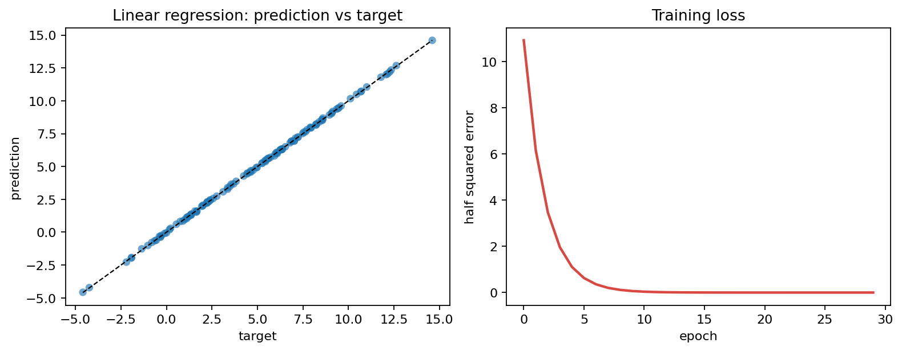
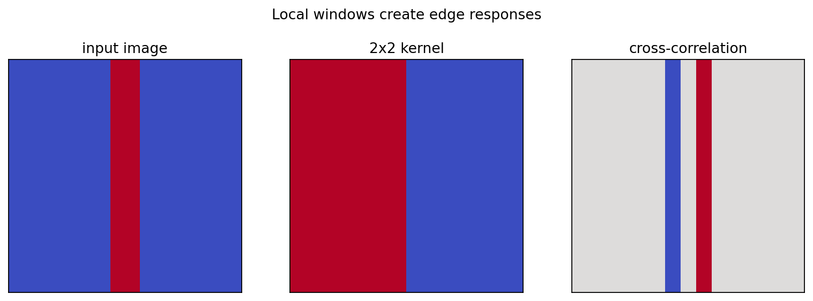
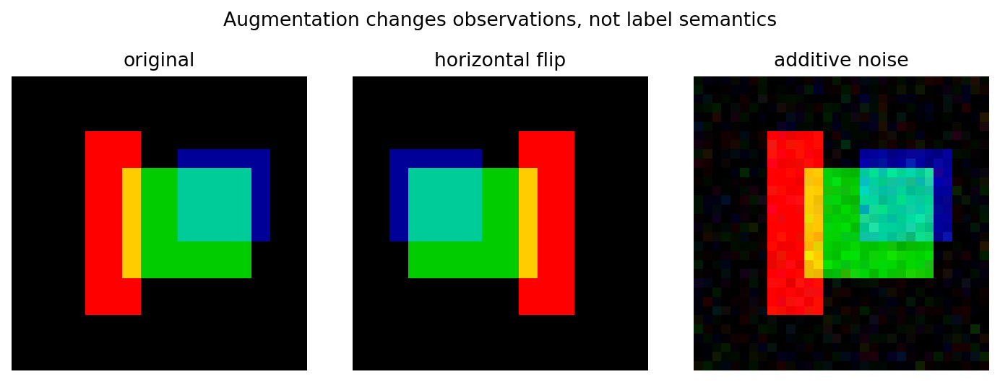
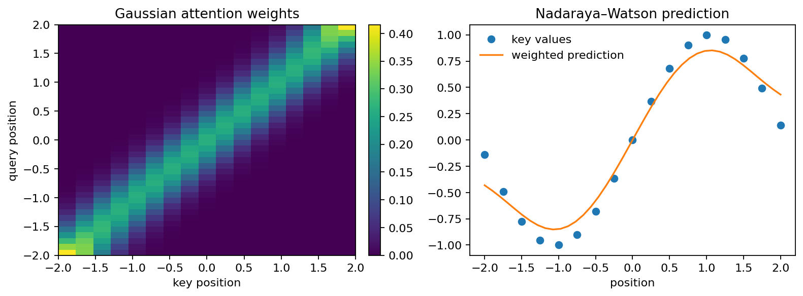

# PyTorch Deep Learning Practice

> A structured, testable learning portfolio built while studying *Dive into Deep Learning* (D2L).

这个仓库记录我沿着《动手学深度学习》的学习路线，对核心概念进行的个人 PyTorch 练习、重构与验证。它不是官方 D2L 源码的镜像，也不把课程示例包装成原创算法；重点在于把“读懂概念”推进到“能够独立实现、测试、解释和复现实验”。

## 项目亮点

- 从线性回归、Softmax 回归和感知机出发，逐步连接到 CNN、视觉迁移学习、序列建模和注意力机制。
- 将脚本式练习整理为可导入的 PyTorch 模块，避免 import 时下载数据或启动长训练。
- 通过单元测试检查张量形状、数值稳定性、mask 语义、残差连接、双向状态和梯度流。
- 用小规模、可重复的实验生成图表；README 中只呈现实际运行得到的结果。
- 保留课程来源、个人改动和验证边界，方便复习，也方便他人阅读代码。

## 学习路线

| 模块 | 课程范围 | 关注问题 | 入口 |
| --- | --- | --- | --- |
| [basics](./basics/) | 08–10 | 梯度下降、损失函数、数值稳定性与线性分类 | [代码](./basics/) |
| [cnn](./cnn/) | 19、22–29 | 局部连接、池化、归纳偏置与残差学习 | [代码](./cnn/) |
| [vision](./vision/) | 36–37 | 数据增强、迁移学习与冻结/解冻策略 | [代码](./vision/) |
| [sequence](./sequence/) | 51–63 | 文本表示、RNN/GRU、双向状态与 seq2seq | [代码](./sequence/) |
| [attention](./attention/) | 64–69 | attention scores、causal mask、Transformer 与 BERT 预训练头 | [代码](./attention/) |

课程编号、原始脚本运行状态和公开代码之间的对应关系见 [lesson-map.md](./docs/lesson-map.md)。

## 快速开始

建议使用 Python 3.10+。在已有的 pytorch Conda 环境中：

~~~powershell
conda activate pytorch
python -m pip install -r requirements.txt
python -m pytest -q
python -m examples.generate_figures --output-dir assets/figures
~~~

如果从零开始配置环境：

~~~powershell
conda create -n pytorch python=3.10 -y
conda activate pytorch
python -m pip install -r requirements.txt
~~~

所有核心测试默认使用 CPU，便于在普通环境中复现；如果检测到 CUDA，测试会额外执行一次轻量 GPU smoke test。真实数据训练、预训练权重和较长实验均不属于默认测试路径。

## 可复核证据

- [课程映射与原始脚本运行矩阵](./docs/lesson-map.md)
- [实验配置、结果与限制](./docs/experiment-results.md)
- [学习反思：从公式到张量契约](./docs/learning-reflections.md)
- [示例图表](./assets/figures/)

## 运行产物

这些图表由 examples/generate_figures.py 在无网络环境下生成，用来展示实现、验证和可视化之间的连接。

## 我的工程化取舍

学习过程中最容易出现的误区，是把“脚本能跑”误认为“实现可复用”。因此本项目有意做了几项约束：

1. 公开模块不依赖本地课程包、绝对路径或隐式全局变量。
2. 每个模块先用小测试固定输入/输出契约，再整理实现。
3. 长训练和网络下载都放到显式入口；测试使用合成数据或极小输入。
4. 对原始脚本的网络、依赖和接口问题保留事实记录；公开版本提供可离线复核的修复或 smoke fallback，不虚构长训练指标。

## 简历描述（English）

**PyTorch Deep Learning Practice — Independent Study Project**

- Reorganized a D2L-based learning codebase into testable PyTorch modules covering optimization, CNNs, transfer learning, recurrent sequence models, attention, and Transformer components.
- Implemented reproducible CPU-first experiments with tensor-shape contracts, numerical-stability checks, masking tests, and lightweight visualization outputs.
- Documented lesson-to-code mappings, execution evidence, engineering decisions, and learning reflections; preserved upstream attribution and licensing.

## 目录结构

~~~text
basics/      数学基础与线性模型
cnn/         卷积、池化与经典 CNN/ResNet 组件
vision/      数据增强与迁移学习
sequence/    文本预处理、RNN/GRU 与 seq2seq
attention/   核回归、注意力、Transformer 与 BERT 组件
tests/       快速、确定性的模块测试
examples/    可复现实验与图表生成
assets/      README 使用的真实输出
docs/        课程映射、结果记录与学习反思
~~~

## 致谢与许可证

概念脉络和部分示例受到 Aston Zhang、Zachary Lipton、Mu Li、Alexander Smola 等作者的 *Dive into Deep Learning* 启发。上游项目地址为 [d2l-ai/d2l-zh](https://github.com/d2l-ai/d2l-zh)。本仓库保留 Apache License 2.0 与 NOTICE，并在此基础上说明个人整理、重构和验证工作。

详见 [LICENSE](./LICENSE) 与 [NOTICE](./NOTICE)。
